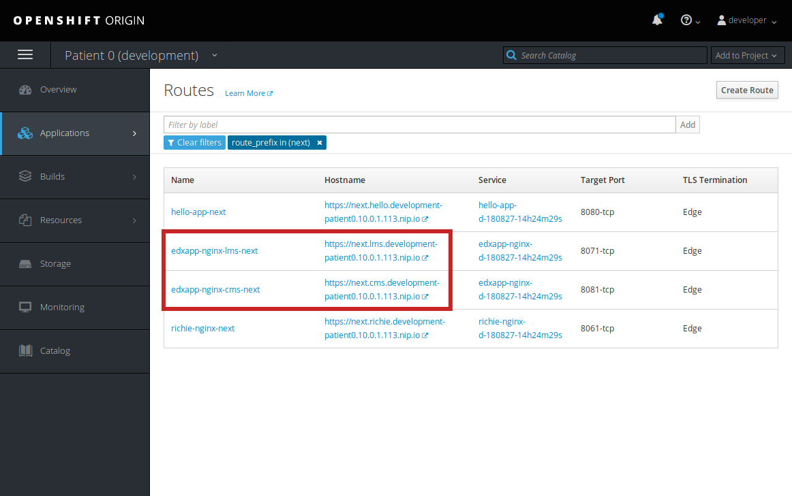

# Arnold

[](https://circleci.com/gh/openfun/arnold)

Arnold is a tool to deploy dockerized applications to
[OpenShift](https://www.openshift.com/) with
[Ansible](https://www.ansible.com/). It was built by France Université Numérique
to ease its infrastructure deployment.

The current work mainly focuses on the [Open edX MOOC
platform](https://open.edx.org/), but it can be considered as a generic tool to
deploy dockerized applications.

## Overview

Arnold has been designed as a suite of Ansible playbooks and OpenShift object
definition templates (Jinja2). We take advantage of the `openshift_raw` Ansible
module to make Ansible talk with OpenShift.

As a DevOps using this project, you will need to adapt OpenShift object
templates to suite your needs or constraints and run playbooks to push your
changes to your OpenShift instance that orchestrates your services.

## Requirements

- [Docker](https://docs.docker.com/engine/installation/): we use docker to
  develop and run Arnold. This is a strict requirement to use this project.
- [OpenShift's client](https://docs.openshift.org/latest/welcome/index.html)
  (_aka_ `oc`): this CLI is used to communicate with the running OpenShift
  instance you will use. Plus, it offers the possibility to run a minimal
  cluster for development purpose (using a set of docker containers).

> Even if we recommend to only use `oc` and docker to work locally with Arnold,
> you might also consider using
> [MiniShift](https://docs.openshift.org/latest/minishift/getting-started/) as a
> relevant alternative to run an isolated OpenShift cluster within a VM (please
> refer to our [instructions to install
> MiniShift](./docs/installation/minishift.md)).

## Quick start

**Disclaimer**: this quick start guide has been written with development /
testing purpose in mind. If you are looking for more insights on how to use it
in production, please refer to our [documentation](./docs/index.md).

### Build Arnold

First things first: you'll need to clone this repository to start playing with
Arnold:

```bash
$ cd path/to/working/directory
$ git clone git@github.com:openfun/arnold.git
```

As we heavily rely on Ansible and OpenShift, we've cooked a Docker container
image that bundles Ansible and the OpenShift CLI (you have already installed
Docker on your machine right?). You can build this image with a little helper we
provide:

```bash
$ cd path/to/cloned/repo
$ bin/build
```

If everything goes well, you must have built Arnold's Docker image. You can
check its availability _via_:

```bash
$ docker images arnold
REPOSITORY          TAG                 IMAGE ID            CREATED             SIZE
arnold              0.1.0-alpha         549baa2b861b        4 days ago          824MB
```

### Run a local OpenShift cluster

You'll need to ensure that you have an OpenShift instance that will be used to
deploy your services. For development or testing purpose, we recommend you to
use the `oc cluster up` command to start a local minimalist cluster to work
with (don't do it now, please read the next paragraph first).

Before starting the cluster, make sure that your system meets the following
requirements:

1. Make sure that the `/etc/docker/daemon.json` file contains at list
   `172.30.0.0/16` as insecure registry:

```json
{
  "insecure-registries": ["172.30.0.0/16"]
}
```

2. To run ElasticSearch (you'll probably have an application that will use it),
   you will need to ensure that your kernel's vm.max_map_count parameter is at
   least `262144`:

```bash
$ sudo sysctl -w vm/max_map_count=262144
```

Now that you've configured your system, you can safely start a cluster _via_:

```bash
# Substitute 192.168.1.10 with your local IP
$ OPENSHIFT_DOMAIN="192.168.1.10"
$ K8S_AUTH_HOST="https://${OPENSHIFT_DOMAIN}:8443"
$ oc cluster up --public-hostname="${OPENSHIFT_DOMAIN}"
```

If everything goes well, you can start a web browser with the following address
to access the web console: https://192.168.1.10:8443 (replace `192.168.1.10`
with your local IP).

You can log in the web console with `developer` as your username **and**
password.

> _nota bene_: you'll probably be asked to accept the connection even if it is
> insecure (SSL certificate issue). Please do so.

And finally you must also login from the CLI to be allowed to perform requests
on the OpenShift cluster:

```bash
$ oc login --insecure-skip-tls-verify=true -u developer -p developer "${K8S_AUTH_HOST}"
```

As we are gentle people, we also provide a shortcut to automate running a new
cluster and login to it:

```bash
# Substitute 192.168.1.10 with your local IP that has access to the internet
$ bin/dev 192.168.1.10
```

Please, note that **you do not need to run** `bin/dev` if you have already
started a local cluster and logged in with `oc`.

### Deploy!

Now that you have a working OpenShift cluster, let's have fun (sic!) by creating
a project for a customer in a particular environment with a new helper:

_nota bene_: when running this command, you'll be asked for a **vault
password**. The default value for this demo is: `arnold`.

```bash
$ bin/bootstrap
```

Tadaaa! Arnold has created a new OpenShift project called `patient0-development`
with a collection of services up and running.

When `edxapp`'s first deployment has completed successfully, we invite you to
test the lms or studio application with the following credentials:

| username | password | email               | is staff | is superuser |
| :------- | :------- | :------------------ | :------: | :----------: |
| student  | student  | student@example.com |    no    |      no      |
| teacher  | teacher  | teacher@example.com |    no    |      no      |
| staff    | staff    | staff@example.com   |   yes    |      no      |
| admin    | admin    | admin@example.com   |   yes    |     yes      |

_nota bene_: you will find URLs of the studio or lms services from the web
console (Application > Routes). You should see a page like the screenshot below.



### Going further

By following this quick start, you only scratched the surface of Arnold's
capabilities. We invite you to read the project's documentation (see below), to
know more about Arnold's core features such as:

- multiple client/environment configurations support
- blue/green deployment strategy
- application discovery (add your own applications easily)
- ...

## Documentation

The full documentation of the project is available in this repository (see
[./docs](./docs)) (and also in readthedocs soon).

## Contributing

Please, see the [CONTRIBUTING](CONTRIBUTING.md) file.

## Contributor Code of Conduct

Please note that this project is released with a [Contributor Code of
Conduct](http://contributor-covenant.org/). By participating in this project you
agree to abide by its terms. See [CODE_OF_CONDUCT](CODE_OF_CONDUCT.md) file.

## License

The code in this repository is licensed under the MIT license terms unless
otherwise noted.

Please see `LICENSE` for details.
